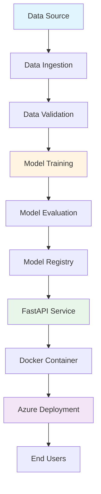

<div align="center">

# 🗑️ Waste Detection System

### *AI-Powered Real-Time Object Detection for Waste Management*

[](https://www.python.org/)
[](https://github.com/ultralytics/ultralytics)
[](https://fastapi.tiangolo.com/)
[](https://azure.microsoft.com/)
[](https://www.docker.com/)
[](LICENSE)

<p align="center">
  
  
  
</p>

[Features](#-key-features) •
[Demo](#-demo) •
[Installation](#-installation) •
[Usage](#-usage) •
[Architecture](#-project-architecture) •
[Deployment](#-deployment) •
[Contributing](#-contributing)

</div>

---

## 📋 Table of Contents

- [Overview](#-overview)
- [Key Features](#-key-features)
- [Demo](#-demo)
- [Technology Stack](#-technology-stack)
- [Project Architecture](#-project-architecture)
- [Installation](#-installation)
- [Usage](#-usage)
- [Model Training](#-model-training)
- [API Documentation](#-api-documentation)
- [Deployment](#-deployment)
- [Project Structure](#-project-structure)
- [Contributing](#-contributing)
- [License](#-license)
- [Contact](#-contact)

---

## 🌟 Overview

**Waste Detection System** is an end-to-end computer vision project leveraging the power of **YOLO11** for real-time waste object detection. This production-ready solution is designed to help automate waste management processes, improve recycling efficiency, and contribute to environmental sustainability.

The project encompasses the complete ML lifecycle:
- 📊 **Data Ingestion & Validation**
- 🧠 **Model Training & Optimization**
- 🚀 **RESTful API Development**
- ☁️ **Cloud Deployment on Azure**
- 🐳 **Containerization with Docker**

Perfect for smart cities, recycling facilities, and environmental monitoring applications.

---

## ✨ Key Features

<table>
<tr>
<td>

### 🎯 Core Capabilities
- ✅ Real-time waste object detection
- ✅ Multiple waste category classification
- ✅ High accuracy with YOLO11 architecture
- ✅ Batch and single image processing
- ✅ Video stream analysis support

</td>
<td>

### 🛠️ Technical Features
- ✅ Modular and scalable architecture
- ✅ Comprehensive logging system
- ✅ Custom exception handling
- ✅ Automated training pipeline
- ✅ Model versioning support

</td>
</tr>
<tr>
<td>

### 🌐 Deployment Ready
- ✅ FastAPI-based REST API
- ✅ Docker containerization
- ✅ Azure cloud deployment
- ✅ CI/CD pipeline compatible
- ✅ Production-grade code quality

</td>
<td>

### 📊 MLOps Integration
- ✅ Data validation checks
- ✅ Model performance tracking
- ✅ Artifact management
- ✅ Configuration management
- ✅ Reproducible experiments

</td>
</tr>
</table>

---

## 💻 Technology Stack

<div align="center">

### Core Technologies


### Libraries & Frameworks

| Category | Technologies |
|----------|-------------|
| **Deep Learning** | PyTorch, Ultralytics YOLO11, TorchVision |
| **Computer Vision** | OpenCV, Pillow |
| **Data Science** | NumPy, Pandas, Matplotlib, Seaborn |
| **API Framework** | FastAPI, Uvicorn |
| **Utilities** | PyYAML, Dill, From-Root, Gdown |
| **Deployment** | Docker, Azure App Service |

</div>

---

## 🏗️ Project Architecture



### Pipeline Components

1. **Data Ingestion**: Automated data collection and preprocessing
2. **Data Validation**: Schema validation and quality checks
3. **Model Training**: YOLO11 training with custom configurations
4. **Model Evaluation**: Performance metrics and validation
5. **API Service**: RESTful API for inference
6. **Deployment**: Containerized cloud deployment

---

## 📥 Installation

### Prerequisites

- Python 3.8 or higher
- pip package manager
- Git
- (Optional) Docker for containerization

### Quick Start

#### 1️⃣ Clone the Repository

```bash
git clone https://github.com/NayeemHossenJim/Object-Detection.git
cd Object-Detection
```

#### 2️⃣ Create Virtual Environment

**Windows:**
```powershell
python -m venv venv
.\venv\Scripts\activate
```

**Linux/macOS:**
```bash
python3 -m venv venv
source venv/bin/activate
```

#### 3️⃣ Install Dependencies

```bash
pip install --upgrade pip
pip install -r requirements.txt
```

#### 4️⃣ Install Package in Development Mode

```bash
pip install -e .
```

---

## 🚀 Usage

### Running the Application

#### Start the FastAPI Server

```bash
uvicorn app:app --reload --host 0.0.0.0 --port 8000
```

#### Access the Application

- **Web Interface**: http://localhost:8000
- **API Documentation**: http://localhost:8000/docs
- **ReDoc**: http://localhost:8000/redoc

### Using the API

#### Python Example

```python
import requests

# Upload image for detection
url = "http://localhost:8000/predict"
files = {"file": open("waste_image.jpg", "rb")}
response = requests.post(url, files=files)

print(response.json())
```

#### cURL Example

```bash
curl -X POST "http://localhost:8000/predict" \
     -H "accept: application/json" \
     -H "Content-Type: multipart/form-data" \
     -F "file=@waste_image.jpg"
```

---

## 🧠 Model Training

### Configure Training Parameters

Edit the configuration files in `wasteDetection/constant/training_pipeline/`

### Run Training Pipeline

```python
from wasteDetection.pipeline.training_pipeline import TrainingPipeline

# Initialize and run training
pipeline = TrainingPipeline()
pipeline.run_pipeline()
```

### Training Notebook

For interactive training and experimentation:

```bash
jupyter notebook research/trials.ipynb
```

---

## 📚 API Documentation

### Endpoints

| Method | Endpoint | Description |
|--------|----------|-------------|
| `GET` | `/` | Home page |
| `POST` | `/predict` | Single image prediction |
| `POST` | `/batch-predict` | Batch image prediction |
| `GET` | `/health` | Health check endpoint |
| `GET` | `/docs` | Interactive API documentation |

### Request/Response Examples

#### Prediction Request

```json
{
  "image": "base64_encoded_image_string"
}
```

#### Prediction Response

```json
{
  "predictions": [
    {
      "class": "plastic_bottle",
      "confidence": 0.95,
      "bbox": [x1, y1, x2, y2]
    }
  ],
  "inference_time": "0.045s"
}
```

---

## 🐳 Deployment

### Docker Deployment

#### Build Docker Image

```bash
docker build -t waste-detection:latest .
```

#### Run Container

```bash
docker run -p 8000:8000 waste-detection:latest
```

### Azure Deployment

#### Prerequisites
- Azure CLI installed
- Azure subscription active

#### Deploy to Azure App Service

```bash
# Login to Azure
az login

# Create resource group
az group create --name waste-detection-rg --location eastus

# Create App Service plan
az appservice plan create --name waste-detection-plan \
    --resource-group waste-detection-rg --sku B1 --is-linux

# Deploy container
az webapp create --resource-group waste-detection-rg \
    --plan waste-detection-plan --name waste-detection-app \
    --deployment-container-image-name waste-detection:latest
```

### Environment Variables

Create a `.env` file in the root directory:

```env
MODEL_PATH=models/best.pt
CONFIDENCE_THRESHOLD=0.5
IOU_THRESHOLD=0.45
MAX_DETECTIONS=100
AZURE_STORAGE_CONNECTION_STRING=your_connection_string
```

---

## 📁 Project Structure

```
Object-Detection/
│
├── 📂 wasteDetection/              # Main package
│   ├── 📂 components/              # Core components
│   │   ├── data_ingestion.py      # Data loading & preprocessing
│   │   ├── data_validation.py     # Data quality checks
│   │   └── model_trainer.py       # Model training logic
│   │
│   ├── 📂 constant/                # Configuration constants
│   │   ├── application.py         # App-level constants
│   │   └── 📂 training_pipeline/  # Training configs
│   │
│   ├── 📂 entity/                  # Data classes
│   │   ├── artifacts_entity.py    # Artifact definitions
│   │   └── config_entity.py       # Configuration entities
│   │
│   ├── 📂 pipeline/                # ML pipelines
│   │   └── training_pipeline.py   # Training orchestration
│   │
│   ├── 📂 utils/                   # Utility functions
│   │   └── main_utils.py          # Helper functions
│   │
│   ├── 📂 exception/               # Custom exceptions
│   └── 📂 logger/                  # Logging configuration
│
├── 📂 research/                    # Experiments & notebooks
│   └── trials.ipynb               # Experimentation notebook
│
├── 📂 templates/                   # HTML templates
│   └── index.html                 # Web interface
│
├── 📂 data/                        # Dataset directory
│
├── 📄 app.py                       # FastAPI application
├── 📄 requirements.txt             # Python dependencies
├── 📄 setup.py                     # Package configuration
├── 📄 Dockerfile                   # Docker configuration
├── 📄 template.py                  # Project structure generator
├── 📄 LICENSE                      # License file
└── 📄 README.md                    # This file
```

---

## 🤝 Contributing

Contributions are welcome! Here's how you can help:

### How to Contribute

1. **Fork the repository**
2. **Create a feature branch**
   ```bash
   git checkout -b feature/AmazingFeature
   ```
3. **Commit your changes**
   ```bash
   git commit -m "Add some AmazingFeature"
   ```
4. **Push to the branch**
   ```bash
   git push origin feature/AmazingFeature
   ```
5. **Open a Pull Request**

### Development Guidelines

- Follow PEP 8 style guidelines
- Add unit tests for new features
- Update documentation as needed
- Ensure all tests pass before submitting PR

---

## 📝 License

This project is licensed under the **MIT License** - see the [LICENSE](LICENSE) file for details.

---

## 📧 Contact

**Nayeem Hossen Jim**

- 📧 Email: [nayeemhossenjim@gmail.com](mailto:nayeemhossenjim@gmail.com)
- 💼 GitHub: [@NayeemHossenJim](https://github.com/NayeemHossenJim)

---
## ⭐ Show Your Support

If you find this project helpful, please consider giving it a ⭐️ on GitHub!

---
